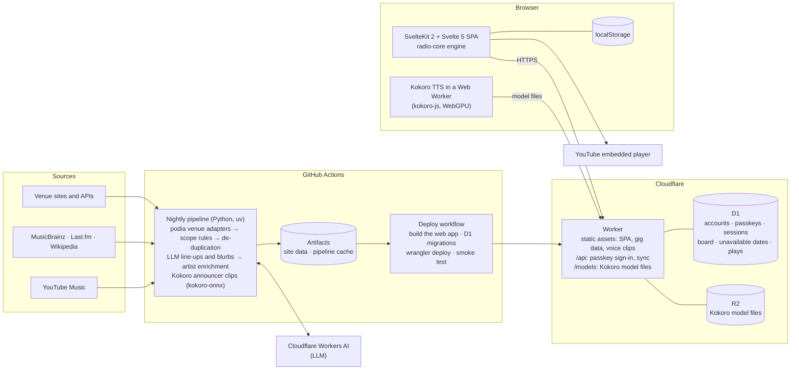

# giggle

Upcoming gigs in and around Amsterdam, and a radio that plays the artists: see what's on, hear
who's worth a ticket, and sort them into a board that syncs across your devices.

## Architecture

- **Every night** GitHub Actions collects the venues' agendas, keeps what's in scope, works out
  line-ups with an LLM, enriches the artists and renders the announcer's intro clips, then
  deploys the result.
- **The site** is one Cloudflare Worker: static assets for the app and the data, plus a small API
  on D1 for passkey sign-in and syncing personal data. The browser plays music through YouTube's
  embedded player and speaks the announcer's live lines with Kokoro, running locally in a Web
  Worker.

## Layout

- `packages/podia/` — venue agenda library, publishable on its own
- `pipeline/` — the nightly build (`giggle-build`)
- `packages/radio-core/` — the radio engine: queue, order, announcer text, timing (TypeScript, no
  dependencies)
- `web/` — the SvelteKit app
- `worker/` — the Cloudflare Worker, D1 migrations, deploy notes (`worker/README.md`)

## Development

`nix develop` (or direnv), then `make help`. `make dev` runs the whole stack locally (web on
localhost:5173, the Worker with a local D1 and R2 on :8787); `make data-offline` builds the data
from recorded fixtures without touching the network.

Licensed under the [Blue Oak Model License 1.0.0](LICENSE.md).
